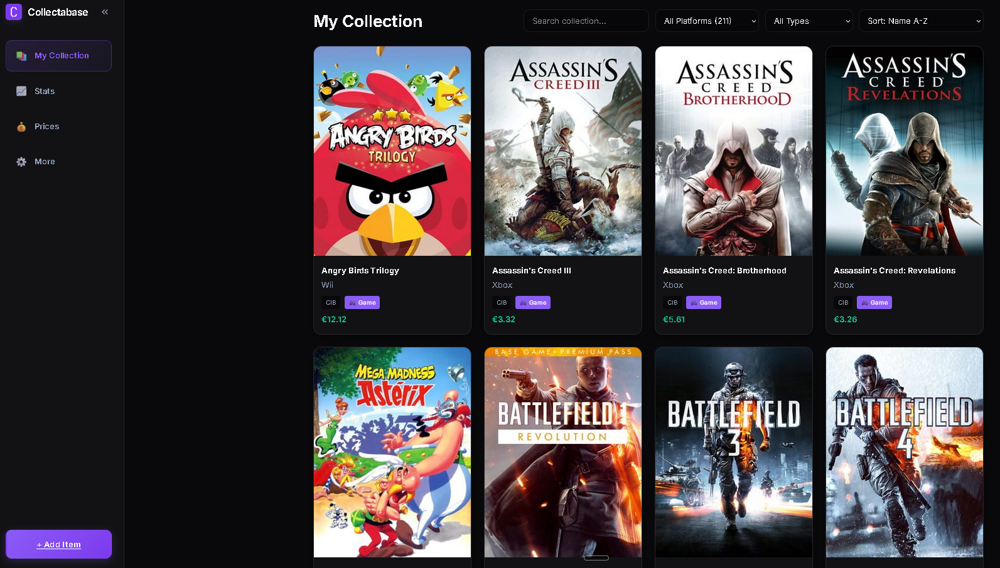
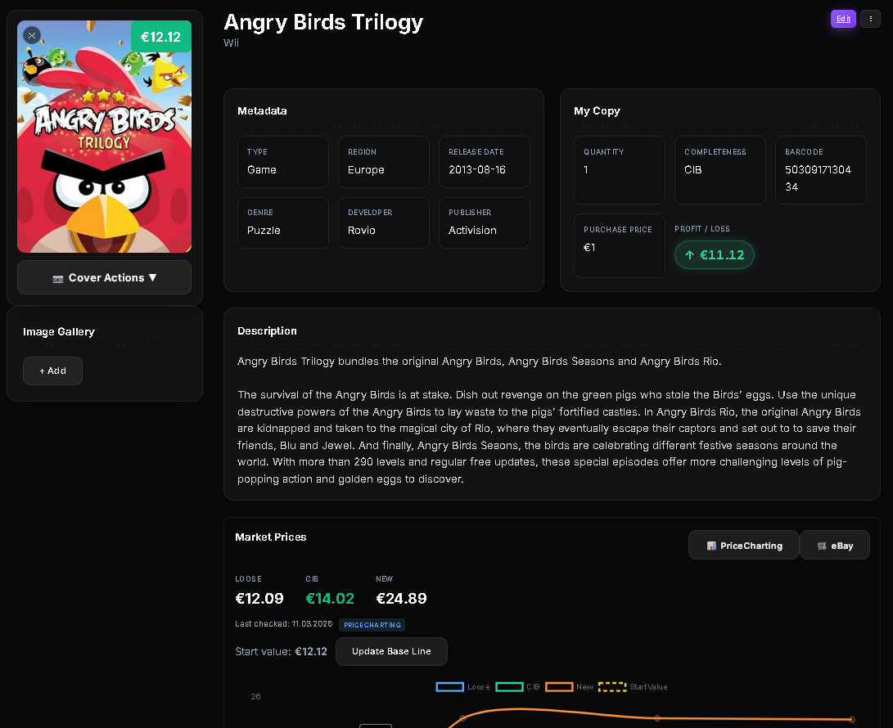
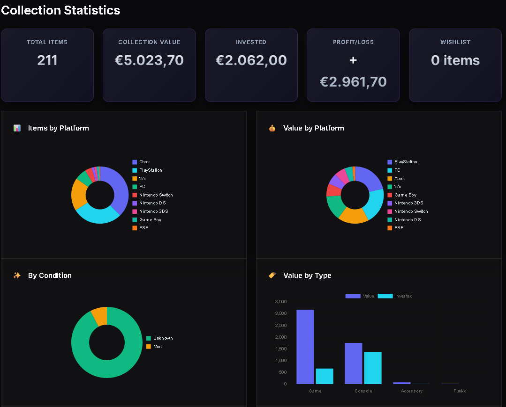
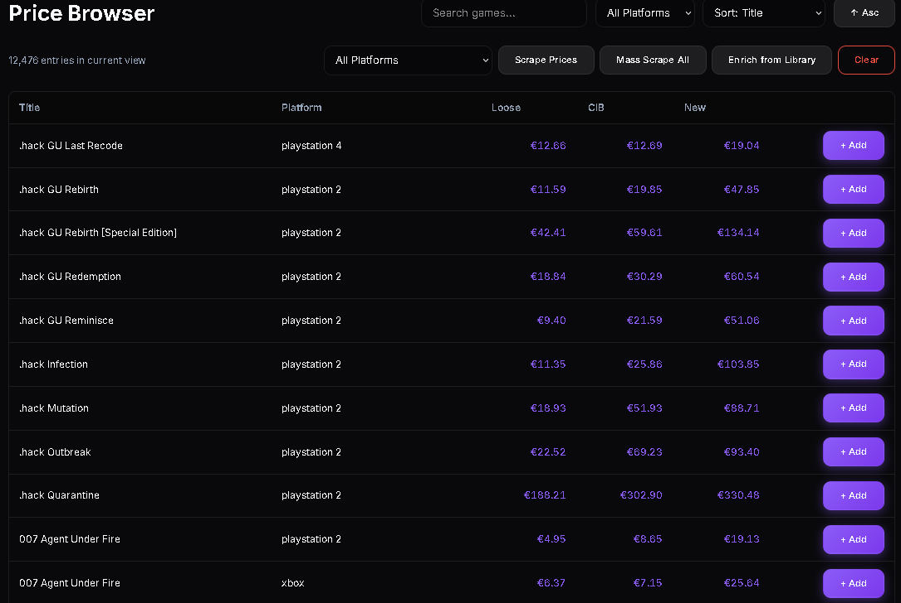

# Collectabase 🎮

A self-hosted, sleek, and fully automated **collection manager** for games, consoles, Funko Pops, anime figures, comics, and more. Your free, robust alternative to CLZ Games — with smarter pricing, beautiful UI, and complete control over your data.

<!-- Save your screenshots as: docs/screenshot-collection.png, docs/screenshot-detail.png, docs/screenshot-stats.png, docs/screenshot-prices.png -->

| Collection Overview | Item Detail |
|:---:|:---:|
|  |  |

| Statistics | Price Browser |
|:---:|:---:|
|  |  |

---

## ✨ Features

### 📊 Collection Management
- Track **games, consoles, controllers, accessories, Funko Pops, anime figures, comics, and vinyl** — all in one place
- Multi-image support with primary cover selection
- Quantity tracking, condition grading, completeness status
- Barcode scanning (UPC/EAN) for quick item lookup
- Wishlist with max price alerts

### 💰 Smart Price Tracking
- **Automated market pricing** via PriceCharting catalog scraping
- **eBay Browse API** as intelligent fallback with item-type-aware filtering
- **IQR-based outlier detection** for accurate median prices
- Background bulk price updates on your schedule
- Full price history per item with interactive charts
- Manual price override — you stay in control

### 🔍 Auto-Enrichment
- Cover art and metadata via **IGDB**, **RAWG**, and **GameTDB**
- Funko Pop images via **eBay proxy** (no HobbyDB API needed)
- Anime figure images via **eBay proxy** (no MFC API needed)
- Comic metadata via **ComicVine**
- Local image caching — no broken hotlinks

### 📈 Analytics & Insights
- Collection value over time (daily snapshots)
- Profit/loss per item and platform
- Top valuable items & biggest gainers
- Platform, condition, and item type breakdowns

### 🖥️ Premium UI
- Responsive glassmorphism dark mode design
- Collapsible desktop sidebar + mobile bottom navigation
- Installable as **Progressive Web App** (PWA)
- Full keyboard/barcode scanner support

---

## 🏗️ Tech Stack

| Layer | Technology |
|-------|-----------|
| **Backend** | FastAPI · Python 3.11 · SQLAlchemy · Alembic · SQLite |
| **Frontend** | Vue 3 (Composition API) · Vite · Pinia · Chart.js |
| **Deployment** | Docker · Portainer-ready · Health Check built-in |

---

## 🚀 Quick Start

### Docker Compose (recommended)

```bash
git clone https://github.com/TheDachlatte007/collectabase.git
cd collectabase
docker-compose up -d --build
```

Open **http://localhost:8000** — done.

### Portainer Stack

Create a new Stack and paste the contents of `docker-compose.yml`, or point to this repository.

### Persistent Data

| Volume | Purpose |
|--------|---------|
| `./data:/app/data` | SQLite database |
| `./uploads:/app/uploads` | Locally cached cover images |

Your data survives container restarts and rebuilds.

---

## 🔑 Configuration

All API keys are managed through the **Settings page** — no `.env` file editing required.

| Provider | Purpose | Get Key |
|----------|---------|---------|
| **IGDB** | Game cover art & metadata | [Twitch Dev Console](https://dev.twitch.tv/console/apps) |
| **RAWG** | Alternative metadata provider | [RAWG.io](https://rawg.io/apidocs) |
| **eBay** | Fallback market prices + Funko/Figure images | [eBay Developers](https://developer.ebay.com/) |
| **PriceCharting** | Primary market prices (optional token) | [PriceCharting](https://www.pricecharting.com/) |

> **Note:** PriceCharting scraping works without an API token. The token is only needed for the official API fallback.

### Optional: Admin API Key

Set `ADMIN_API_KEY` as an environment variable or Docker secret to protect write operations when exposing your instance beyond your LAN. Without it, admin actions are allowed only from local/private IPs.

---

## 🛠️ Local Development

### Backend

```bash
cd backend
python -m venv .venv
source .venv/bin/activate  # Windows: .venv\Scripts\activate
pip install -r requirements.txt

# Create/update database schema
alembic upgrade head

# Start API server
uvicorn backend.main:app --reload
```

### Frontend

```bash
cd frontend
npm install
npm run dev
```

The Vite dev server proxies API requests to the backend on port 8000.

---

## 🐳 Docker Health Check

Collectabase includes a built-in health endpoint at `/api/health`:

```json
{
  "status": "healthy",
  "version": "1.0.0",
  "database": "ok",
  "uptime_seconds": 3600
}
```

The Docker image runs a health check every 30 seconds. Portainer and Docker Desktop will show the container health status automatically.

---

## 🗂️ Project Structure

```
collectabase/
├── backend/
│   ├── api/routes/       # FastAPI route modules
│   ├── services/         # Lookup, pricing, scraping logic
│   ├── db/               # SQLAlchemy models & session
│   ├── alembic/          # Database migrations
│   ├── main.py           # App entry point
│   ├── scheduler.py      # Background job scheduler
│   └── price_tracker.py  # Price fetching orchestration
├── frontend/
│   ├── src/views/        # Vue page components
│   ├── src/api/          # API client layer
│   └── public/           # PWA manifest, icons, service worker
├── docker-compose.yml
├── Dockerfile
└── README.md
```

---

## 📝 License

MIT License. Built with ❤️ for collectors.
